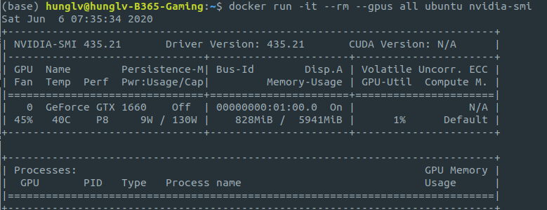

# Docker-All-We-Need

## 1. System Requirements


## Update Docker

- Ubuntu: 18.04

## 2. Install the docker

Take a look the reference [Docker Installation](https://docs.docker.com/engine/install/ubuntu/). I have built a script that automatically installs the docker engine. 
```
bash install_docker.sh
```

## 3. Docker with Travis CI 

Download a sample repo which uses docker with travis CI 
```
git clone https://github.com/leviethung2103/WEB1066-probot-hello
cd WEB1066-probot-hello
# Go to master_docker branch 
checkout master_docker
```

We need to have the Dockerfile inside the folder.

Test the project locally to see it works or not, on your computer:

- Install the docker (already done) -  Step 1 
- Build the project with Dockerfile - Step 3.1 
- Test the project inside Docker container - Step 3.2

### 3.1 Build locally

```
docker build -t probot-hello .
```

### 3.2 Test the project

```
docker run -it --rm probot-hello npm run test
```

--rm: remove the container on exit. 

## 4. Develop locally 

Changes to source code get reflected in the container and node restarts our app with the lastest changes

```
docker run -it --rm |
			-e APP_ID=abc \
			-e PRIVATE_KEY=none \
			-w /home/node/probot-hello-dev \
			-v "$(pwd)":/home/node/probot-hello-dev \
			-p 3000:3000 probot-hello \
			bash -c 'npm install && npm run dev'
```

`npm run dev`: watcher to changes, see the real time updates in the application.


**Dockerfile Sample**

```
# https://hub.docker.com/_/node/
FROM node:8-onbuild

# use debug to troubleshoot
ENV LOG_LEVEL=error
# Required env settings determined by GitHub App
ENV APP_ID=1234
ENV WEBHOOK_SECRET=development
ENV WEBHOOK_PROXY_URL=https://localhost:3000/
ENV PRIVATE_KEY="someprivatestring"

# see https://github.com/nodejs/docker-node/blob/e3ec2111af089e31321e76641697e154b3b6a6c3/docs/BestPractices.md#global-npm-dependencies
ENV NPM_CONFIG_PREFIX=/home/node/.npm-global
ENV PATH=$PATH:/home/node/.npm-global/bin

# Lets install our app into /home/node
COPY . /home/node/probot-hello
RUN chown -R node:node /home/node/probot-hello

# setup our app
# non-root user  https://github.com/nodejs/docker-node/blob/e3ec2111af089e31321e76641697e154b3b6a6c3/docs/BestPractices.md#non-root-user
USER node

WORKDIR /home/node/probot-hello
RUN npm install
```

## 5. NVIDIA-Docker

### 5.1 Installation 

We need to install the NVIDIA driver, no need to install the CUDA toolkit on the host. The CUDA toolkit will be installed inside the `Container`. 

Take note of your Docker version with `docker -v`. Versions **earlier than** 19.03 require nvidia-docker2 and the `--runtime=nvidia` flag. On versions **including and after** 19.03, you will use the `nvidia-container-toolkit` package and the `--gpus all` flag. Both options are documented on the page linked above.


```
bash install_nvidia_docker.sh
```

### 5.2 Usage

With the release of Docker 19.03, usuage of `nvidia-docker2` packages are **deprecated**.

The NVIDIA GPUs are now natively supported as devices in the Docker runtime.**Please note that this native GPU support has not landed in docker-compose yet**. 

Now one can simply pass -**-gpus** option for GPU-accelerated Docker based application.

**Check the docker version**

```
$ docker -v 
Docker version 19.03.11, build 42e35e61f3
```

**Example**

```
docker run -it --rm --gpus all ubuntu nvidia-smi
```



**Test nvidia-smi with the lasted official CUDA image**

```
docker run --gpus all nvidia/cuda:10.0-base nvidia-smi
```

new image: `nvidia/cuda:10.0-base` 

**Starting a GPU enabled container on specific GPUs 1 and 2**

```
docker run --gpus '"device=1,2"' nvidia/cuda:10.0-base nvidia-smi
```

**How about if we don't specify the tag --gpus ?**

```
$ docker run nvidia/cuda:10.0-base nvidia-smi
docker: Error response from daemon: OCI runtime create failed: container_linux.go:349: starting container process caused "exec: \"nvidia-smi\": executable file not found in $PATH": unknown.
ERRO[0001] error waiting for container: context canceled
```

## 6. Docker Compose

Compose is a tool for defining and running multi-container Docker applications. 

With Compose, you can use a YAML file to configure your application's services. Then, with a single command, you create and start all the services from your configuration. 

Using Compose is basically a three-step process:

1. Define your app's environment with a `Dockerfile` so it can be reproduced anywhere.
2. Define the services that make up your app in `docker-compose.yml` so they can be run together in an isolated environment. 
3. Run docker-compose up and Compose starts and runs your entire app 

A `docker-compose.yml` looks like this:

```
version: '2.0'
services:
  web:
    build: .
    ports:
    - "5000:5000"
    volumes:
    - .:/code
    - logvolume01:/var/log
    links:
    - redis
  redis:
    image: redis
volumes:
  logvolume01: {}
```

Compose has commands for managing the whole lifecycle of your application:

- Start, stop, and rebuild services
- View the status of running services
- Stream the log output of running services
- Run a one-off command on a service

## 6.1 Docker Compose Features

The features of Compose that make it effective are:

- [Multiple isolated environments on a single host](https://docs.docker.com/compose/#multiple-isolated-environments-on-a-single-host)
- [Preserve volume data when containers are created](https://docs.docker.com/compose/#preserve-volume-data-when-containers-are-created)
- [Only recreate containers that have changed](https://docs.docker.com/compose/#only-recreate-containers-that-have-changed)
- [Variables and moving a composition between environments](https://docs.docker.com/compose/#variables-and-moving-a-composition-between-environments)

For more information, take a look [DockerCompose](https://docs.docker.com/compose/).

## 6.2 Install Docker Compose 

Check the version of Docker Compose

```
$ docker-compose --version
```

```
bash scripts/install_docker_compose.sh
```

## 6.3 Download a Tensorflow Docker Image

The official TensorFlow Docker images are located in the [tensorflow/tensorflow](https://hub.docker.com/r/tensorflow/tensorflow/) Docker Hub repository. Image releases [are tagged](https://hub.docker.com/r/tensorflow/tensorflow/tags/) using the following format:

| Tag         | Description                                                  |
| :---------- | :----------------------------------------------------------- |
| `latest`    | The latest release of TensorFlow CPU binary image. Default.  |
| `nightly`   | Nightly builds of the TensorFlow image. (unstable)           |
| *`version`* | Specify the *version* of the TensorFlow binary image, for example: *2.1.0* |
| `devel`     | Nightly builds of a TensorFlow `master` development environment. Includes TensorFlow source code. |

Each base *tag* has variants that add or change functionality:

| Tag Variants      | Description                                                  |
| :---------------- | :----------------------------------------------------------- |
| *`tag`*`-gpu`     | The specified *tag* release with GPU support. ([See below](https://www.tensorflow.org/install/docker#gpu_support)) |
| *`tag`*`-py3`     | The specified *tag* release with Python 3 support.           |
| *`tag`*`-jupyter` | The specified *tag* release with Jupyter (includes TensorFlow tutorial notebooks) |

There are two ways to get the docker images

1. Use the `docker-compose.yml`

```
sudo docker-compose -f tensorflow-docker.yml up --build
```

2. Use directly the terminal 

```
docker pull tensorflow/tensorflow                     # latest stable release
docker pull tensorflow/tensorflow:devel-gpu           # nightly dev release w/ GPU support
docker pull tensorflow/tensorflow:latest-gpu-jupyter  # latest release w/ GPU support and Jupyter
```

Inside of `tensorflow-docker.yml` 

```
version: '3'
services:
  tf: 
      image: tensorflow/tensorflow:latest-gpu
      ports:
        - 8888:8888
      volumes:
        - .:/notebooks
```

**List all the images**

```
docker image ls
```


**Start a Tensorflow Docker container** 

```
docker run [-it] [--rm] [-p hostPort:containerPort] tensorflow/tensorflow[:tag] [command]
```

**Example** 

```
docker run -it -p 8888:8888 tensorflow/tensorflow:latest-gpu-jupyter
```

**However, this one only uses the Tensorflow-CPU** 

```
from tensorflow.python.client import device_lib
print(device_lib.list_local_devices())
[name: "/device:CPU:0"
device_type: "CPU"
memory_limit: 268435456
locality {
}
incarnation: 189652975046659030
, name: "/device:XLA_CPU:0"
device_type: "XLA_CPU"
memory_limit: 17179869184
locality {
}
incarnation: 6518940841554504313
physical_device_desc: "device: XLA_CPU device"
]
```

**How to use the tensorflow wit enabled-GPU?** 

just simply pass the tag --gpus all 

````
docker run -it -p 8888:8888 --gpus all  tensorflow/tensorflow:latest-gpu-jupyter
````

It will shows the GPU like this 

```
[name: "/device:CPU:0"
device_type: "CPU"
memory_limit: 268435456
locality {
}
incarnation: 14274143214298123097
, name: "/device:XLA_CPU:0"
device_type: "XLA_CPU"
memory_limit: 17179869184
locality {
}
incarnation: 8827210151315510378
physical_device_desc: "device: XLA_CPU device"
, name: "/device:XLA_GPU:0"
device_type: "XLA_GPU"
memory_limit: 17179869184
locality {
}
incarnation: 4945486739601633121
physical_device_desc: "device: XLA_GPU device"
, name: "/device:GPU:0"
device_type: "GPU"
memory_limit: 4890624000
locality {
  bus_id: 1
  links {
  }
}
incarnation: 5081808267847125318
physical_device_desc: "device: 0, name: GeForce GTX 1660, pci bus id: 0000:01:00.0, compute capability: 7.5"
]
```


### [Advanced] Setup host machine for build and running our docker container

Install the container based on `Dockerfile` or `docker-compose.yml` 

- Setup to show GUI tracking 360 cam (X11 forwarding mode)
  - Modify [.env](https://github.com/awl-vietnam/project9-Toppan/blob/develop/.env) file
    - SHOW_GUI=True
  - Setup X11

```
$ XSOCK=/tmp/.X11-unix
$ XAUTH=/tmp/.docker.xauth
$ touch ${XAUTH}
$ xauth nlist ${DISPLAY} | sed 's/^..../ffff/' | xauth -f ${XAUTH} nmerge -
```

- Build and start the docker container

```
# Adds docker to X server access control list (ACL)
$ xhost + local:docker

# Build and run the services
$ docker-compose up --build

# Removes docker out of X server ACL if you are not working with
$ xhost - local:docker
```

## Docker Compose with GPUs
Basically, after installing the nvidia-docker, we can run the container via `docker run`. However, it's a little tricky when using the `docker compose up`. 

In order to use the `gpus` as well as `cuda` library, we need to specify the runtime argument inside the `docker-compose.yml`. 

By doing that, we can easily run the gpus via `docker-compose` command. 

Install the nvidia-docker2 is a must. 
```
sudo apt-get install -y nvidia-docker2
```

Configure the `/etc/docker/daemon.json` file.
```
"runtimes": {"nvidia": { "path": "/usr/bin/nvidia-container-runtime","runtimeArgs": [] } }
```

in your docker-compose YML you should add:
runtime: nvidia

Verified verison: Cuda 10.1 - Devel - Ubuntu 18 without cudnn
> FROM nvidia/cuda:10.1-devel-ubuntu18.04 as nvidia_base

## Reference

 [Docker Installation](https://docs.docker.com/engine/install/ubuntu/)

[Continous Integration](https://www.coursera.org/learn/continuous-integration/home/welcome)

[TensorflowDocker](https://www.tensorflow.org/install/docker)


## Helper